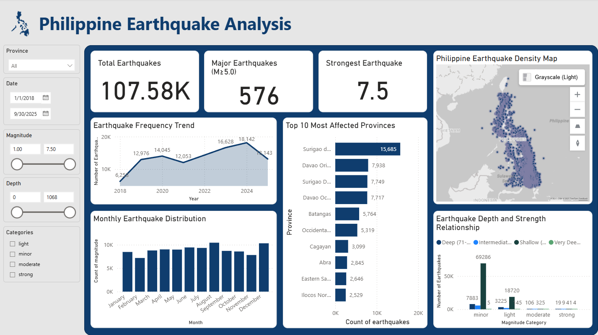

# Philippine Seismic Activity Analysis Project

## Problem Statement
The Philippines experiences frequent seismic activity due to its location along the Pacific Ring of Fire. There was a need to systematically collect and analyze earthquake data to understand patterns, identify high-risk areas, and support disaster preparedness planning.

## Project Objective
To collect Philippine earthquake data from 2018-2025, analyze seismic patterns, and create visualizations that help understand earthquake risks and inform safety planning.

## My Approach
- **Data Collection**: Built a web scraper to extract earthquake data from PHIVOLCS (Philippine Institute of Volcanology and Seismology) official website
- **Data Cleaning**: Processed raw earthquake data, handled duplicates, and converted data types for analysis
- **Data Analysis**: Analyzed earthquake patterns using key seismic indicators
- **Data Visualization**: Created a Power BI dashboard to make the findings clear and accessible

## Tools and Techniques Used
- **Python**: For web scraping and data processing (requests, BeautifulSoup, pandas)
- **Power BI**: For creating interactive visualizations
- **Data Analysis**: Focused on practical seismic risk indicators

## Key Analysis Metrics
1. **Total Earthquakes**: Overall count of seismic events recorded
2. **Earthquake Frequency Trend**: Tracking changes in earthquake occurrence over years
3. **Major Earthquakes Count**: Number of potentially damaging events (M≥5.0)
4. **Most Active Regions**: Geographic areas with highest seismic activity
5. **Strongest Earthquakes**: Highest magnitude events recorded
6. **Depth vs Magnitude**: Relationship between earthquake depth and strength
7. **Monthly Patterns**: Seasonal distribution of seismic activity

## Dashboard

## Key Findings

### Finding 1: Significant Increase in Seismic Activity
**Analysis**: Earthquake frequency has dramatically increased from 6,264 in 2018 to 18,142 in 2024 - nearly tripling in just 6 years. The data shows consistent year-over-year growth with 2023-2024 being particularly active periods.

**Implication**: This sharp increase suggests changing seismic patterns that require updated risk assessments and emergency preparedness levels.

### Finding 2: Geographic Concentration in Eastern Regions
**Analysis**: Surigao Del Sur is the most seismically active province with 15,685 earthquakes - more than double the second-ranked Davao Oriental (7,938). The top 4 provinces are all in eastern Mindanao, indicating a major seismic hotspot region.

**Implication**: Eastern Mindanao requires prioritized disaster management resources, stricter building codes, and enhanced public education programs.

### Finding 3: Major Earthquakes Are Deeper
**Analysis**: Strong earthquakes (M≥6.0) occur at much greater depths (77km average) compared to minor quakes (29km). Moderate earthquakes (M5.0-5.9) average 49km depth, while light quakes average 34km.

**Implication**: The depth pattern is positive news - the most damaging earthquakes tend to be deeper, which reduces their surface impact.

### Finding 4: Consistent Monthly Activity with Minor Variations
**Analysis**: August (10,448) and December (10,322) show the highest activity, while February (7,186) has the lowest. However, the distribution is relatively even across months without extreme seasonal patterns.

**Implication**: Earthquake preparedness should be maintained year-round, with no specific "safe season" for relaxation of safety measures.

### Finding 5: Multiple Major Earthquakes Recorded
**Analysis**: Eight earthquakes reached magnitude 7.0 or higher, with the strongest being M7.5 near Itbayat, Batanes in 2024. Surigao Del Sur and Davao regions experienced multiple major events.

**Implication**: The Philippines experiences regular major seismic events capable of causing significant damage, reinforcing the need for robust infrastructure and emergency response systems.

## Summary
This analysis of 107,585 earthquakes from 2018-2025 reveals critical insights about Philippine seismic activity. The alarming increase in earthquake frequency, combined with concentrated activity in eastern Mindanao, highlights regions needing immediate attention for disaster preparedness. The depth patterns provide some reassurance that stronger quakes tend to be deeper, but the occurrence of multiple M7.0+ earthquakes underscores the constant threat of major seismic events.

The data provides a clear roadmap for prioritizing disaster management resources and developing targeted preparedness strategies for the most vulnerable regions of the Philippines.
